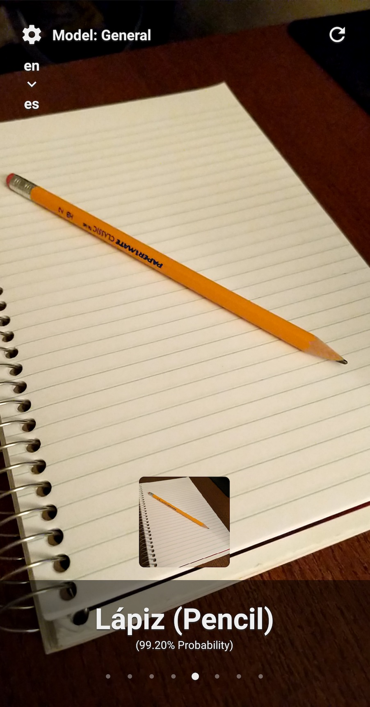

# What the thing is?

Object detection application with trained models - translating the predictions to help learn a new language :)

Built with React Native, Clarifai, and Microsoft Translator!

(Inspired by https://github.com/dmotz/thing-translator)

#### Local Development

`npm install`

`cd ios/` && `pod install`

**You will need free API keys for both Clarifai and MS Translator**
- https://www.clarifai.com/
- https://docs.microsoft.com/en-us/azure/cognitive-services/translator/quickstart-translator?tabs=nodejs

Rename `.env.example` to `.env` with your own keys.

Start dev server with `npx react-native start` and run with:

`npx react-native run-android` or `npx react-native run-ios`

 

##### Todo List: (Pull requests welcome!)

- Support additional languages. Currently hard codeded to go from English -> Spanish
- Add support for additional models (or custom models)

